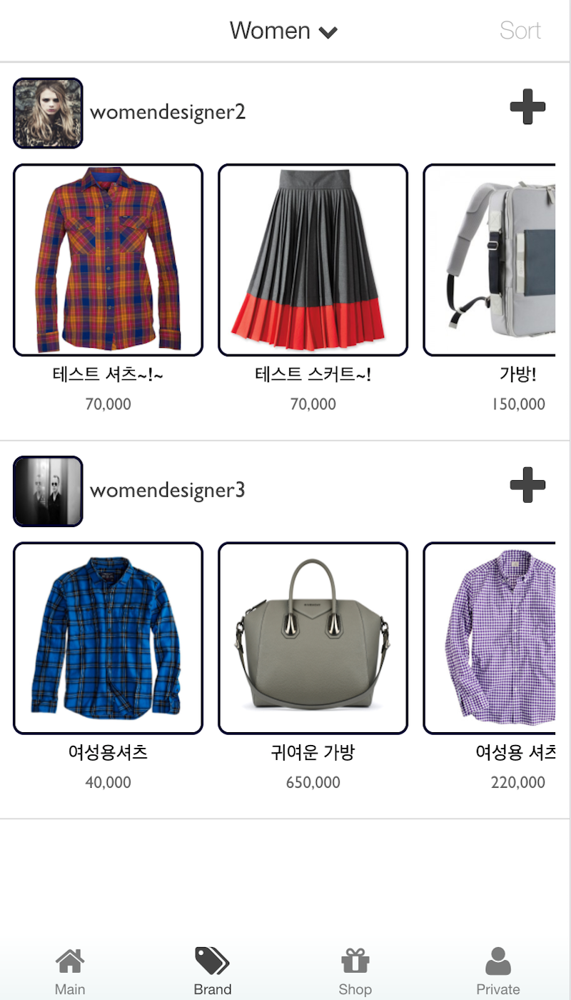

# Radio

####[데모 영상](https://www.youtube.com/watch?v=RFWTNNT7i5M)

### 모듈 구조
	 radio
       |- radio.service
          |- RadioAuth
          |- Brand
          |- Cart
          |- Channel
          |- Shop
          |- Follow
          |- Like
       |- radio.controller
          |- MasterCtrl
             |- LoginCtrl
             |- SignupCtrl
             |- TabsCtrl
                |- MainCtrl
                |- MyCodyCtrl
                |- MyBrandCtrl
                |- MyProductCtrl
            	|- ShopIntroCtrl
                |- BrandIntroCtrl
	            |- BrandDetailCtrl
                |- ProductDetailCtrl
                |- ChannelDetailCtrl
                |- ChannelCodyDetailCtrl
				|- PrivateInfoCtrl
                |- PrivateCodyCtrl
                |- PrivateChannelCtrl
                |- PrivateBrandCtrl
                |- PrivateProductCtrl
